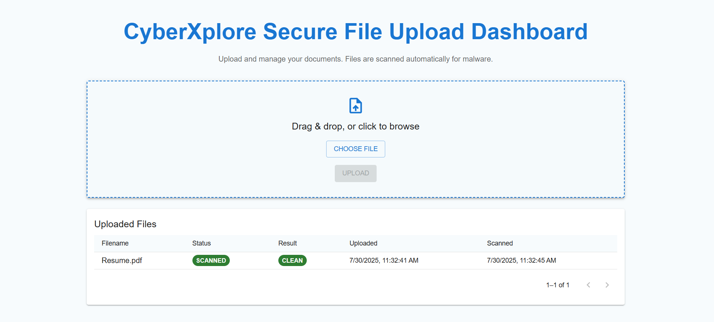

# CyberXplore Secure File Upload & Malware Scanner

A full-stack demo app to upload files, scan them asynchronously for malware (simulated), and manage their status via a **modern, responsive React dashboard with Material UI** styling.

---

## Features

- Drag-and-drop or click-to-upload modern upload card with icon and progress feedback  
- Upload `.pdf`, `.docx`, `.jpg`, `.png` files (max 10MB)
- Backend scanning jobs handled in a queue (asynchronously)
- MongoDB for file metadata and scan status
- **Aesthetic React UI**: color-coded statuses (pending/clean/infected), Material UI table, live updates, loader spinners, snackbars, and pagination

---

## Table of Contents

- [Setup Instructions](#setup-instructions)
  - [Backend](#backend)
  - [Frontend](#frontend)
  - [MongoDB](#mongodb)
  - [Queue Simulation](#queue-simulation)
- [Scanning Simulation](#scanning-simulation)
- [How to Run Locally](#how-to-run-locally)
- [Sample Screenshots](#sample-screenshots)
- [Tech Stack](#tech-stack)
- [Notes](#notes)

---

## Setup Instructions

### Backend

1. Clone or download this repository.
2. In a terminal:
    ```
    cd backend
    npm install
    ```
3. Create a `.env` file in `backend`:
    ```
    MONGO_URI=mongodb://localhost:27017/cyberxplore
    PORT=4000
    ```
    *(Or your MongoDB Atlas URI if using cloud.)*

4. Install `tsx` (if needed) and start the backend:
    ```
    npm install -D tsx
    npm run start
    ```
    This starts both the API and the scanning worker on `http://localhost:4000`.

---

### Frontend (Modern React UI)

1. Open a new terminal:
    ```
    cd frontend
    npm install
    ```
2. Start the React app:
    ```
    npm start
    ```
3. Browse to [http://localhost:3000](http://localhost:3000).

---

### MongoDB

- Ensure a local `mongod` is running, or Atlas cluster is accessible with proper URI.
- Database URI configured through your `.env`.

---

### Queue Simulation

- The backend uses a custom **in-memory queue** for scanning jobs.
- No additional setup required—everything runs with one backend process.

---

## Scanning Simulation

- After each upload, a scan job is queued.
- The backend worker processes jobs by:
    - Waiting a random **2–5 seconds** (simulating scan delay)
    - Reading the file for keywords: `rm -rf`, `eval`, `bitcoin`
    - If found → marks file as **infected**, else as **clean**
- Result and status updates are stored in MongoDB and reflected live in the dashboard.

---

## How to Run Locally

1. Start MongoDB.
2. In one terminal:
    ```
    cd backend
    npm run start
    ```
3. In another terminal:
    ```
    cd frontend
    npm start
    ```
4. Open [http://localhost:3000](http://localhost:3000) in your browser.
5. Enjoy a modern UI:
    - Drag or select files to upload.
    - See live status updates (pending, clean, infected) shortly.
    - Uploaded files are listed with pagination, color coding, and proper timestamps.

---

## Sample Screenshots

### **File Upload UI and Dashboard UI**




## Tech Stack

- **Backend:** Node.js, Express.js, TypeScript
- **Frontend:** React, TypeScript, **Material UI**
- **Database:** MongoDB (with Mongoose)
- **Queue:** Custom in-memory queue for jobs

---

## Notes

- **UI Highlights**:
    - Drag-and-drop upload card with icon, animated upload button, spinner, and snackbars for feedback
    - Color-coded status chips: Orange for pending, Green for clean, Red for infected
    - Modern Material UI table with sticky header, stripes, auto-refresh, pagination, and loader during fetch
    - Consistent theme, padding, and fonts for a professional dashboard look
---
